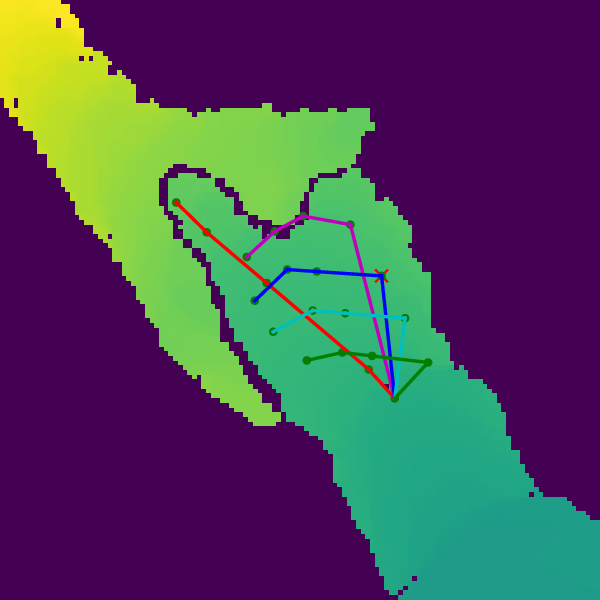

# Final Year Project: Joint Hand Pose Estimation and Action Recognition

<!--  -->
<p align="center"></p>

## About
>This project investigates the design of a framework to fuse two vastly different deep learning
architectures in a way that predictions of one output can be used to help predict the other whilst utilising previous estimates to refine future ones.
The two tasks considered are 3D hand skeleton (pose) estimation using CNNs and
estimated hand skeleton based egocentric action recognition using RNNs. Multiple
techniques are proposed, the best of which reduces the raw error gap in action recognition accuracy when using
predicted hand skeletons versus using ground truth data from 4.3% to just 1%.


---


## Contributions

1. A strong baseline is developed that achieves joint hand pose estimation and action
recognition using a straight-forward and extendable approach to empirically
prove that a boost in performance is achievable over disjoint methods for the particular case
of egocentric hand pose estimation and action recognition.<br><br>
1. This approach is extended using a proposed sequential action feedback connection. This method does not show clear improvements over the baseline and further analysis is performed why this is so.<br><br>
2. A novel boosting based method is proposed which utilises action
feedback to provide implicit data augmentation. This method beats both the
previous method and the baseline. Useful insights on the performance
of the individual components within this approach are investigated.
 

## Summary of Results

| Model | Pose Estimation Error (mm) | Accuracy (%) |
| ----  | ---------------------------| ------------ |
| HPE Standalone | 14.49 | - |
| HAR Standalone <br> (GT Pose*) | - | 72.3 |
| Baseline (No Train) | 14.49 | 59.0 |
| Baseline (No Train) | 10.87 | 68.0 |
| Proposed Method #1 | 10.95 | 68.2 |
| Proposed Method #2 <br>(+ Attention) | 10.69 | 71.3 |


\* Note that these results are reported using ground truth hand poses which is practically infeasible and is only presented to show the best achievable score.


---

## Structure
### Folder Structure
  ```
  root/
  │
  ├── train.py - main entry-point to start training
  |
  ├── test.py - main entry-point to evalate any trained model from checkpoint (*.pth)
  │
  ├── configs/ - yaml based configs for all reported experiments
  │   ├── combined/
  |   |   └── *.yaml - combined model configs
  │   ├── hpe/
  |   |   └── *.yaml - hpe model configs
  │   └── har/
  |       └── *.yaml - har model configs
  │   
  ├── data_utils/ - anything about data loading goes here
  |   ├── base_data_loader.py - abstract base class
  |   ├── collate_functions.py - helper functions for custom collation
  |   ├── data_augmentors.py - helper functions for data augmentation (mostly unused)
  |   ├── data_transformers.py - data transformation functions
  |   ├── data_loaders.py - data loader classes for hpe, har and combined modeldebu
  │   └── debug_plot.py - functions to general gifs and comparative plots of different methods 
  │
  ├── datasets/ - default directory for storing input data
  |   ├── base_data_types.py - base types used for data_utils
  |   └── hand_pose_action.py - pytorch extended dataset class for dataset used
  |
  ├── docs/ - misc rough notes (may be removed in future)
  │
  ├── ext/ - external files
  │
  ├── img/ - images for readme
  |
  ├── logs/ - default logdir for tensorboardX
  |
  ├── metrics/ - losses, and metrics
  │   ├── loss.py
  │   └── metric.py
  │
  ├── models/ - models, losses, and metrics
  |   ├── base_model.py - abstract base class
  │   ├── har_baseline_model.py - har model class
  │   ├── hpe_baseline_model.py - hpe model class
  │   └── combined_model.py - combined model class
  |
  ├── results/ - plot generation scripts and pdfs presented in report
  |
  ├── saved/ - default checkpoints folder
  |
  ├── tests/ - pytorch unit tests for some model variants
  │
  ├── trainer/ - trainers
  |   ├── base_trainer.py - abstract base class
  │   └── trainer.py - main trainer class
  │
  └── utils/
      ├── util.py
      ├── logger.py - class for train logging
      ├── visualization.py - class for tensorboardX visualization support
      └── ...
  ```

### Notes
- `datasets`: includes raw dataset files plus helper functions to load and/or debug and/or display raw information from dataset. Should include at-least one class of pytorch datasets derived type with `__getitem__` function
- `data_utils`: includes all functions that manipulate data in any way after being loaded in raw forma and before being input to any model. Also includes functions to collect results during testing i.e. perform inverse transformations or other manipulation to transform outputs from models back to the same scope as the raw data. These can be used to store evaluation results in the same format as gt labels.
- `utils`: all other extra helper functions needed during the training and/or testing can include:
  - Additional losses e.g. 3D avg error not directly used for the purpose of training.
  - Visualisation of training, tensorboardX, visualisation of final losses e.g. % of frames vs mm error.
  - Logging and progress-bar etc
- `ext`: anything from externel sources that is either used directly, indirectly or kept as a reference.
- `models`: code defining models and their variants.
- `metrics`: including losses and eval metrics for validation etc. These files are to be moved.
- `trainer`: code defining training and validation stuff for one epoch, these are referenced by top-level `train.py`


---


## Code Instructions
All models can be trained with the exact same configuration as used for the reported results. Depending on OS, CUDA, Python and Pytorch versions, results may slightly vary. The most prominent experiments have their own configuration file which can be passed as a command-line argument to the pain entry-point file for training: `train.py`.

Combined models require pre-training and then fine-tuning. A cache of some pre-trained models will be provided in the future. Please observe the config files to see where to make changes as appropriate for the save locations of the pre-trained file.

### Prerequisites
The easiest route for prerequistes is to first install [miniconda](https://docs.conda.io/en/latest/miniconda.html) and then create an environment using the supplied setup file:

```
conda env create -f setup/conda-env.yml
conda activate jhpear
```

Note that an Nvidia CUDA 10.0 compatible GPU is required. If that is not the case then `configs/setup/conda-env-cpu.yaml` can be used instead, however a GPU is highly recommended and is a must for training.

### Commands
TBC

<!-- | Model | Command | Notes
| ----  | --------| ------------ |
| HPE Standalone | 14.49 | - |
| HAR Standalone <br> (GT Pose*) | - | - |
| Baseline (No Train) | 14.49 | - |
| Baseline (No Train) | 10.87 | - |
| Proposed Method #1 | 10.95 | - |
| Proposed Method #2 <br>(+ Attention) | 10.69 | - | -->


---

## Acknowledgements
Where possible this document aims to acknoledges sources used for this project.

### Main Structure
Template from https://github.com/victoresque/pytorch-template. See `LICENSE-1` for details on the license.

### Dataset + Hand Model Image + Most Details
https://github.com/guiggh/hand_pose_action

### Some Helper Utils and Transformers
https://github.com/dragonbook/V2V-PoseNet-pytorch


